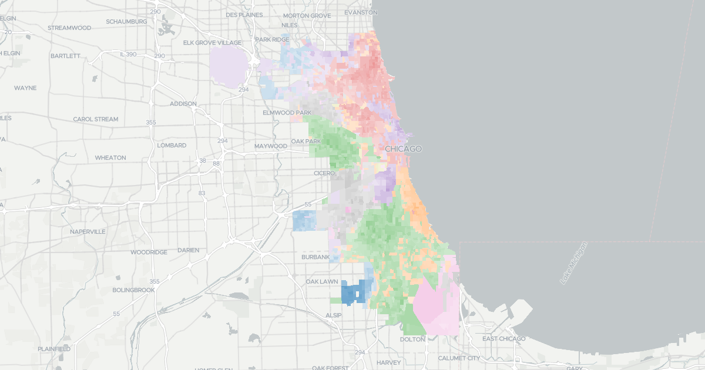

# Chicago Elections Archive

Explore precinct-level results from recent and historical Chicago elections.



## Setup - native

```shell
pip install -r requirements.txt
npm install
make all
```

## Setup - Docker

Set up local environment variables:

```shell
cp .env.sample .env
```

Build the containers and make the data:
```shell
docker-compose build
```

Run the site locally:
```shell
docker-compose up
```

## Updating Data

Note: if you are updating the remote data: please generate the election data before updating the 

### Updating Election Data:

To update the election data, run:
- `python3 scripts/scrape_metadata.py`
- `python3 scripts/scrape_elections.py`

### Upgrading Geographic data:

- `make all` will build all of the geographic data.
- `make build-output` can be run to GZIP all files in a separate directory that can be deployed to cloud storage with.
- `make deploy` will upload the output to the cloud storage.

To update the displayed elections on the site, update `ELECTION_ORDER` in `site/_data/site.js`.

## Data Notes

- Missing precincts for years:
  - a few missing for 2004, 2003, 2002
  - 2000 missing a good amount
  - 1983 missing a few
